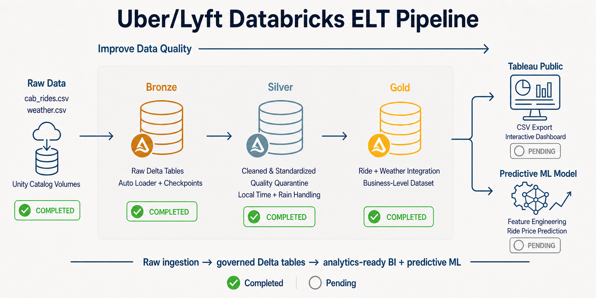

# Uber/Lyft Databricks ELT Pipeline for Tableau

An end-to-end Databricks ELT project that ingests Uber/Lyft ride and Boston weather data, applies a Bronze–Silver–Gold medallion architecture, and prepares reusable Gold data for Tableau Public analytics and predictive machine learning.

## Medallion Architecture Progress



## Pipeline Status

| Stage | Status | Purpose |
|---|---|---|
| Raw data | ✅ Completed | Original Uber/Lyft ride and weather CSV files |
| Unity Catalog volumes | ✅ Completed | Governed storage for source files, checkpoints, and exports |
| Bronze | ✅ Completed | Incremental raw ingestion with Auto Loader |
| Silver | ✅ Completed | Cleaning, standardization, enrichment, and quality control |
| Gold | ✅ Completed | Integrate fare quotes with source and destination weather and publish a curated analytics table |
| Tableau export | ⬜ Pending | Export the Gold dataset for Tableau Public |
| Tableau dashboard | ⬜ Pending | Build interactive business visualizations |
| Predictive ML model | ⬜ Pending | Engineer model features and predict ride prices |

## Data Sources

- `cab_rides.csv`
- `weather.csv`

The original public-source CSV files are included in `data/raw/` for reproducibility and are also uploaded to governed Databricks volumes for pipeline execution.

## Unity Catalog Structure

```text
rideshare_elt
├── bronze
│   ├── cab_rides_raw
│   └── weather_raw
├── silver
│   ├── cab_rides_clean
│   ├── cab_rides_quarantine
│   └── weather_clean
└── gold
    └── rides_weather_enriched
```

The project also uses Unity Catalog volumes for cab-rides files, weather files, pipeline checkpoints, and future Tableau exports.

## Bronze Layer

The Bronze layer incrementally ingests the original CSV files with Databricks Auto Loader and stores the raw values as Delta tables. Explicit schemas, source-file metadata, ingestion timestamps, rescued-data handling, and checkpoints make ingestion traceable and rerunnable.

### Bronze Delta Tables

- `rideshare_elt.bronze.cab_rides_raw`
- `rideshare_elt.bronze.weather_raw`

### Bronze Validation

| Dataset | Rows | Nullable field | Null rows | Null rate | Rescued rows | Source files |
|---|---:|---|---:|---:|---:|---:|
| Cab rides | 693,071 | `price` | 55,095 | 7.95% | 0 | 1 |
| Weather | 6,276 | `rain` | 5,382 | 85.76% | 0 | 1 |

Other required source fields passed the null and validity checks.

- Missing cab prices remain unchanged in Bronze and are routed to a Silver quarantine table.
- Missing weather rain values remain unchanged in the original `rain` column.
- Zero rescued rows confirms that all source columns matched the declared ingestion schemas.
- Auto Loader checkpoints prevent already processed files from being ingested again.

## Silver Layer

The Silver layer cleans, standardizes, and enriches Bronze data while preserving records that fail analytical quality rules.

### Silver Delta Tables

| Table | Rows | Purpose |
|---|---:|---|
| `rideshare_elt.silver.cab_rides_clean` | 637,976 | Valid rides with usable prices |
| `rideshare_elt.silver.cab_rides_quarantine` | 55,095 | Rides excluded from price analysis because the price is missing |
| `rideshare_elt.silver.weather_clean` | 6,276 | Cleaned and standardized weather observations |

The clean and quarantined cab-rides counts reconcile to all 693,071 Bronze records, so no source records were silently discarded.

### Cab-Rides Transformations

- Converted 13-digit Unix millisecond timestamps to UTC.
- Created Boston-local timestamps using `America/New_York`.
- Added local date, hour, weekday, and weekend fields.
- Standardized location, provider, and ride-product text.
- Added surge indicators and price-per-mile calculations.
- Assigned explicit data-quality statuses.
- Preserved all 55,095 missing-price records in the quarantine table.
- Confirmed that all 693,071 ride IDs are unique.

### Weather Transformations

- Converted 10-digit Unix second timestamps to UTC.
- Created Boston-local date and time fields.
- Preserved the original nullable `rain` value.
- Added `rain_was_missing` to identify source nulls.
- Added analytics-ready `rain_amount`, replacing missing rain with `0.0`.
- Added an `is_raining` indicator.
- Validated 12 locations and 6,276 unique location–timestamp keys.
- Confirmed that all 6,276 weather records passed the Silver quality rules.

## Data-Quality Strategy

This pipeline distinguishes between expected source nulls and ingestion failures:

- A **null value** is a successfully ingested source value that is missing.
- A **rescued value** is source data that could not fit the declared schema.
- Missing ride prices are quarantined because they cannot support price analysis.
- Missing rain remains auditable through `rain` and `rain_was_missing`, while `rain_amount` provides an analysis-ready value.
- Bronze retains raw values; Silver applies business and quality rules.

## Gold Layer

The Gold layer combines every valid Silver fare quote with the nearest weather observation at both its source and destination. Both matches use the fare-query timestamp and a maximum tolerance of 60 minutes.

### Gold Delta Table

- `rideshare_elt.gold.rides_weather_enriched`

### Gold Validation

| Metric | Result |
|---|---:|
| Rows | 637,976 |
| Unique fare-quote IDs | 637,976 |
| Curated columns | 36 |
| Source-weather match rate | 100% |
| Destination-weather match rate | 100% |
| Weather-tolerance violations | 0 |

The curated table maintains exactly one row per valid fare quote and retains identifiers, provider and product attributes, source and destination locations, fare measures, query-time fields, endpoint weather features, and Gold refresh metadata.

## Notebooks

| Notebook | Status |
|---|---|
| `00_Environment_Validation.py` | ✅ Completed |
| `01_Bronze_Ingestion.py` | ✅ Completed |
| `02_Silver_Transformations.py` | ✅ Completed |
| `03_Gold_Analytics.py` | ✅ Completed |
| `04_Tableau_Export.py` | ⬜ Next |
| `05_ML_Price_Prediction.py` | ⬜ Planned |

## Repository Structure

```text
Uber_Lyft_Databricks_ELT_Tableau
├── notebooks
│   ├── 00_Environment_Validation.py
│   ├── 01_Bronze_Ingestion.py
│   ├── 02_Silver_Transformations.py
│   └── 03_Gold_Analytics.py
├── sql
├── data
├── tableau
├── docs
├── images
│   └── uber_lyft_databricks_tableau_ml_architecture.png
├── .gitignore
└── README.md
```

## Tableau Public Delivery

Tableau Public does not provide the same live Databricks connectivity as the full Tableau products. The completed Gold dataset will therefore be exported as an analytics-ready CSV and loaded into Tableau Public as an extract.

## Predictive ML Delivery

After the Tableau dashboard is complete, the same governed Gold data will support feature engineering and a predictive model for ride-price estimation. Potential features include provider, ride product, distance, surge multiplier, route, local time, temperature, rain, humidity, cloud cover, and wind.

## Next Phase

The immediate next phase is to export the curated Gold table as a Tableau-ready CSV and build the Tableau Public dashboard. After the dashboard is delivered, the project will continue with feature engineering, model training, evaluation, and ride-price prediction.
